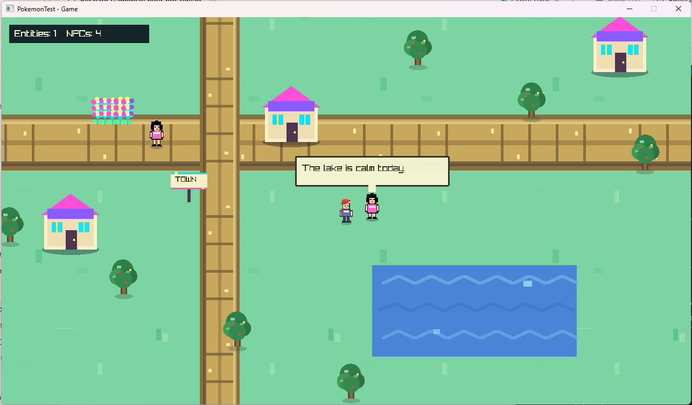
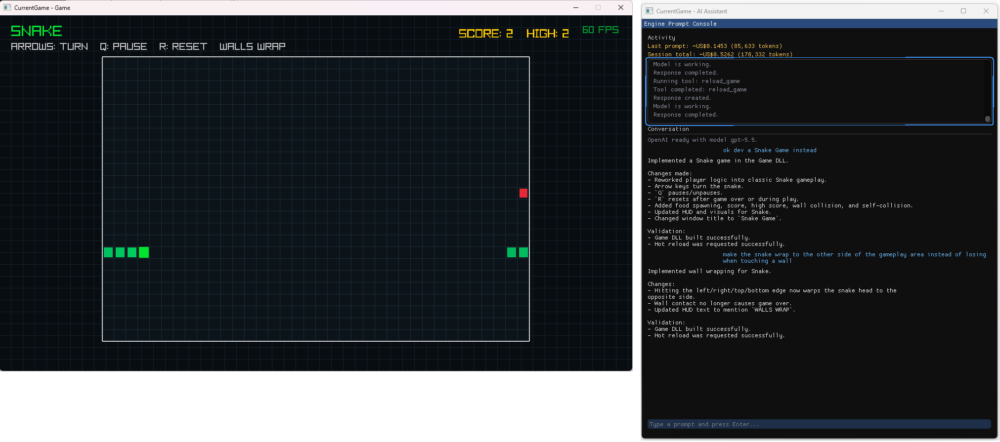
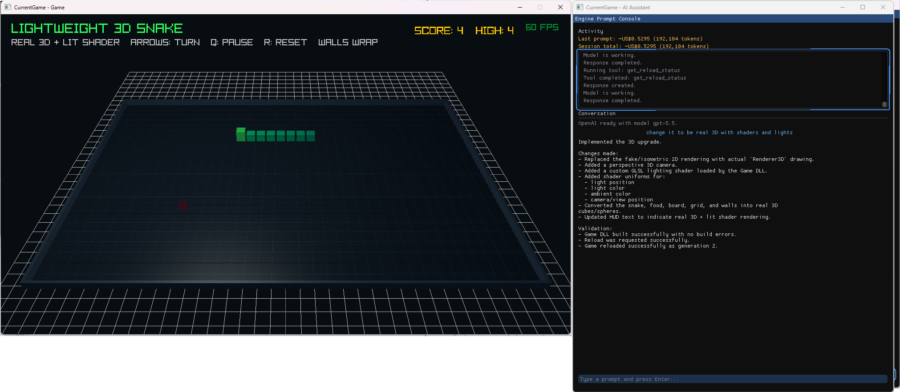
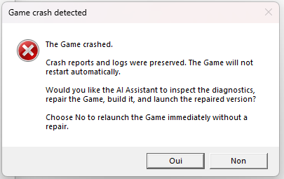

# [**MakeYourOwnGame.AI**](https://github.com/YannickTriqueneaux/MakeYourOwnGame.AI)

MakeYourOwnGame.AI is a lightweight C++ environment for creating small,
procedural games with an AI development assistant.

The goal is productivity: launch a game, play it, describe what you want to
change, and keep playing while the assistant is modifying the game seamlessly.
When the result feels right, the same game can be compiled in Release and
prepared for distribution.

The assistant can create animated vector visuals, procedural sound effects, and
music as part of the same rapid iteration and hot-reload workflow.

MIDI files can be pasted as musical references for AI-authored procedural
music.

Images can also be pasted directly into the assistant's prompt and used as
visual references while developing a game.





*A game created and hot-reloaded from the assistant while the playable session
stays open. The assistant also reports the latest prompt and session token-cost
estimates.*

## The workflow

```text
Play the game
      ↓
Describe a change to the AI
      ↓
AI reads and patches the selected Game
      ↓
Only Game.dll is recompiled
      ↓
GameHost hot-reloads the new DLL
      ↓
Keep playing and iterating
```

The game and assistant run in separate windows:

- `<game-name> - Game`
- `<game-name> - AI Assistant`

Press `Tab` in either window to focus its partner. The assistant conversation
survives Game DLL reloads, allowing an ongoing discussion instead of isolated
one-shot prompts.

## Quick start

Requirements:

- Windows 10 or 11 with PowerShell and Windows Package Manager (`winget`)

`Start.bat` checks Git, CMake, Visual Studio C++ Build Tools, assistant
configuration, and authentication. Already configured items are skipped. When
a required development tool is missing, the script explains what is needed and
asks for confirmation before installing it with `winget`.

Run:

```bat
Start.bat
```

`Start.bat`:

1. checks and, with permission, installs missing development prerequisites;
2. creates the local assistant configuration on a fresh clone and asks whether
   to use Codex CLI or the OpenAI API;
3. installs Codex CLI through OpenAI's official Windows installer when needed;
4. opens the browser for ChatGPT sign-in when Codex is not authenticated, or
   requests an API key when the OpenAI API provider is selected;
5. lists the projects under `Games/` and offers to create a new one;
6. asks which game to open, or asks for a name and copies `BaseGame`;
7. configures and builds that game in its private build directory; and
8. starts its Game and AI Assistant windows.

A [free ChatGPT account](https://learn.chatgpt.com/docs/pricing) can be used to
explore Codex with limited usage; a paid subscription is not required to
start. Paid ChatGPT plans provide higher Codex limits. The OpenAI API
alternative uses a separately billed API key. Codex authentication uses the
official [browser sign-in flow](https://learn.chatgpt.com/docs/auth).

A game can also be selected directly:

```bat
Start.bat CurrentGame
```

## Game projects

Every direct child of `Games/` containing `Source/GameModule.cpp` is an
independent game:

```text
Games/
├── BaseGame/
│   ├── Include/
│   ├── Source/
│   └── build/
└── MyGame/
    ├── Include/
    ├── Source/
    └── build/
```

`BaseGame` is the clean, versioned starting point. Other game directories can
also be versioned normally. The assistant edits the selected
`Games/<game-name>/` directly; there is no temporary source copy.

### Starting a new game

It is strongly recommended to fork this repository before starting a game.
Clone your fork and keep the game under version control so that every change
made manually or by the AI assistant can be reviewed, reverted, and preserved.

To create and start a game:

1. run `Start.bat`;
2. select **Create a new game**;
3. enter the new game's name;
4. wait while `BaseGame` is copied, configured, and built; and
5. use the Game and AI Assistant windows to begin iterating.

The new project is created under `Games/<game-name>/`. Commit that directory to
your fork:

```bat
git add Games/MyGame
git commit -m "Start MyGame"
git push
```

Build outputs under the game directory remain ignored, so commits contain the
game source and content rather than generated files.

To rebuild a known project without the interactive menu:

```bat
dev.bat MyGame
```

To reset a game from `BaseGame` while preserving a timestamped backup:

```bat
reset_game.bat MyGame
```

## How rapid iteration works

### Stable runtime, reloadable game

Reusable systems live in the persistent `Engine` DLL:

- application and window lifecycle;
- procedural 2D and 3D rendering primitives;
- input;
- Dear ImGui;
- serialization interfaces;
- OpenAI communication;
- logging and IPC.

Gameplay lives in a much smaller `Game.dll`:

- input bindings and actions;
- game rules and behaviors;
- entities and state;
- what gets rendered;
- game-specific configuration.

Because the Engine and hosts stay alive, an iteration normally compiles only
the `Game` target. Whenever possible, the Engine restores the running
game so play can continue from where it was interrupted, even after the game
code has changed.

### Choosing 2D or 3D in a game

`GameInterface::Render` receives an `Engine::RenderContext`. A game can use
`context.Draw2D()`, `context.Draw3D()`, or both in the same frame. For 3D,
call `Renderer3D::Begin(camera)` before drawing the world and
`Renderer3D::End()` afterward. Draw 2D overlays after the 3D pass.



*The assistant can convert an existing game to real 3D, add a perspective
camera and an embedded lighting shader, build the updated `Game.dll`, and
hot-reload it while preserving the rapid iteration workflow.*

### Crash recovery and AI-assisted repair

Launcher monitors `GameHost` and distinguishes a normal exit from a crash. It
does not silently restart a crashed game. Instead, it preserves the available
diagnostics and displays a **Game crash detected** dialog with two choices:



*After a crash, the user can ask the AI assistant to investigate and repair the
game, or relaunch it unchanged.*

- **Yes** starts AI-assisted recovery. The game remains stopped while a
  recovery-only GameHost keeps the controlled development tools available.
- **No** relaunches the same game immediately without asking the assistant to
  modify it.


When AI-assisted recovery is accepted:

1. Launcher starts `GameHost --recovery` without loading `Game.dll` or opening
   the game window.
2. The assistant is brought to the foreground and automatically receives one
   recovery request.
3. The assistant reads the newest crash reports and process logs, correlates
   them with the Game source, and applies the smallest justified repair.
4. It builds the Debug `Game` target and repairs compilation errors when
   possible.
5. Only after a successful build may it call `launch_game`, which returns
   control to Launcher and starts the repaired game.

### Controlled AI tools

The assistant cannot execute arbitrary shell commands. It communicates with
the selected GameHost through a game-specific local named pipe and receives a
small set of controlled tools:

- list, read, and search selected Game source files;
- list, read, and search Engine C++ source files in read-only mode;
- read several files in a single batch;
- apply exact replacements individually or as a validated batch;
- build only the selected `Game` target;
- inspect compiler output;
- request a DLL reload and inspect its status;
- inspect recent crash reports and process logs during recovery;
- launch a repaired game from recovery mode after a successful build.

Paths are canonicalized and confined to either the selected Game or the Engine
tree. Only C++ source extensions inside the selected Game are editable. Engine
access has separate list, read, batch-read, and search tools with no patch
operation. Build directories and path traversal are explicitly excluded.

Batch reads and patches reduce AI round trips. The assistant is instructed to
inspect related files together, prepare a coherent set of changes, compile
once, repair compiler failures if necessary, and reload only after a successful
build.

### Persistent conversation

AssistantHost owns the conversation and AI response context. GameHost owns
the playable window and reloadable Game DLL. Recompiling or reloading the Game
therefore does not erase the active AI discussion.

## Multiple games at once

Each game owns:

- `Games/<game-name>/build/`;
- its executables and `Game.dll`;
- hot-reload generations;
- logs;
- a game-specific IPC pipe;
- uniquely titled Game and Assistant windows.

Several games can run simultaneously. Starting or rebuilding one game stops
only processes launched from that game's build directory; other sessions keep
running.

## Architecture

```text
Engine/             Persistent reusable runtime
GameHost/           Game window and Game.dll hot-reload host
AssistantHost/      AI conversation window
Launcher/           Starts the two hosts for one game session
Games/BaseGame/     Versioned starting game
Games/<name>/       Independently editable game project
```

The dependency direction is intentionally strict:

```text
Game → Engine
Engine ✕ Game
```

This boundary keeps the runtime stable while game code changes frequently.
GameHost, AssistantHost, and Launcher also depend on Engine, never the other
way around. AssistantHost owns prompts and loads the selected assistant
provider from a separate DLL.

## Configuration

The assistant provider is selected in:

```text
AssistantHost/Config/settings.json
```

Example:

```json
{
  "assistant": {
    "providerLibrary": "AssistantProviderCodex.dll",
    "providerSettings": "CodexProvider.settings.json"
  }
}
```

`AssistantProviderCodex.dll` uses the signed-in Codex CLI and ChatGPT account.
`AssistantProviderOpenAI.dll` uses an API key. Each provider owns its separate
settings file, and other providers can be integrated without adding their
dependencies to AssistantHost or Engine.

Provider configuration and extension details are documented in
[AI providers](docs/AIProviders.md).

Local settings containing credentials are ignored by Git. API keys and HTTP
authorization headers are never written to application logs.

The Responses API reports real input, cached-input, and output token usage, but
OpenAI does not currently expose an official pricing API. Token prices are
therefore configuration data rather than compiled constants. AssistantHost
uses them to display an estimated cost for the latest completed prompt and for
the complete AssistantHost session. Update the pricing block when OpenAI
changes a model's rates.

## Manual builds

Configure and build one game:

```powershell
cmake -S . -B Games/MyGame/build -DGAME_PROJECT=MyGame
cmake --build Games/MyGame/build --config Debug --parallel
```

Run:

```text
Games/MyGame/build/Debug/Launcher.exe
```

## Shipping a game

Run the interactive release script:

```bat
Release.bat
```

It asks which game to release and produces:

```text
Games/<game-name>/Release/<game-name>.exe
```

The Release target is a native, optimized, monolithic executable. It statically
links the Engine and selected Game and does not ship GameHost, AssistantHost,
Launcher, `Game.dll`, development logs, or hot-reload code. The development FPS
counter is compiled out. `Release.bat` prints the absolute executable path when
the build succeeds.

Distribution metadata, icons, installers, store SDKs, and platform packaging
remain game-specific responsibilities.

Commercial distribution is subject to [LICENSE](LICENSE), including the fixed
CAD $1.00 royalty for each paid copy sold.

## License

Copyright (c) 2026 Yannick Triqueneaux.

MakeYourOwnGame.AI uses the custom
**MakeYourOwnGame.AI Source-Available Contribution and Commercial Game License
1.0**.

This repository is provided to encourage research, learning, experimentation,
and the creative enjoyment of making simple games, including games distributed
free of charge. Commercial use is also permitted under the License. When a
game created with this repository is sold, the applicable reporting obligations
and fixed per-copy royalty apply. This approach is intended to support
accessible non-commercial exploration while establishing clear and consistent
terms for those who benefit commercially from the work.

In summary:

- infrastructure modifications outside `Games/` must be provided to the
  Licensor, including private infrastructure modifications;
- gameplay code and content under `Games/<game-name>/` do not have to be
  disclosed;
- game creators retain ownership of their Game Content;
- commercial use requires quarterly reporting; and
- every paid copy of a game created with the repository carries a fixed
  CAD $1.00 royalty.

The full [LICENSE](LICENSE) controls if this summary differs from its terms.
Third-party dependencies remain governed by their respective licenses.
